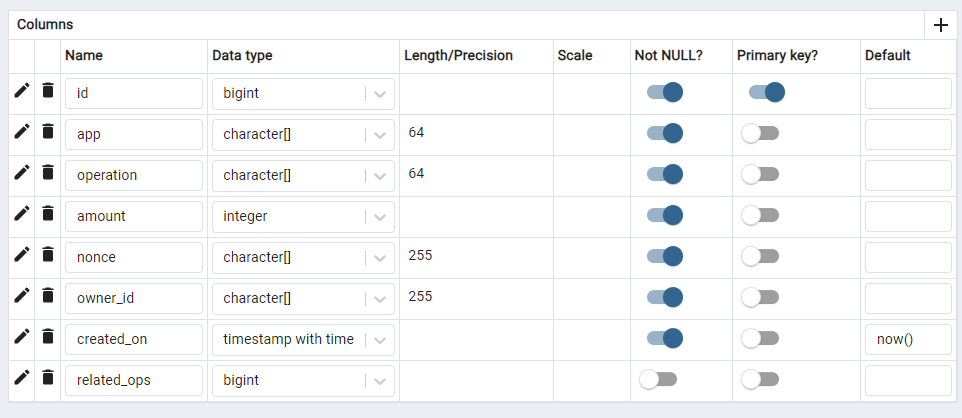

# Monorepo Shared Ledger System

Test project by SevenApps, a generic ledger system to be used by multiple apps in a monorepo implemented strictly with/as Enums and database interactions flowing through SQLAlchemy and Alembic into PostgreSQL.

---

### Quick overview of development

#### Base ledger and its inheritance

```python-repl

# core/ledgers/schemas.py
class BaseLedgerOperation(Enum):
    CREDIT = "CREDIT"        # Add credits
    DEBIT = "DEBIT"          # Subtract credits
    TRANSFER = "TRANSFER"    # Move credits between accounts

# /content/src/api/ledgers/schemas.py
class ContentLedgerOperation(BaseLedgerOperation, Enum):
    # BaseLedgerOperation ops are accessible by dot(.) operator.
    CONTENT_CREATION = "CONTENT_CREATION" # Spend credits to publish content
    CONTENT_ACCESS = "CONTENT_ACCESS"    # Adjust credits for accessing premium content

# /freelance/src/api/ledgers/schemas.py
class FreelancingLedgerOperation(BaseLedgerOperation, Enum):
    # BaseLedgerOperation ops are accessible by dot(.) operator.
    PROJECT_PAYMENT = "PROJECT_PAYMENT"  # Incoming payment for a project
    PROJECT_SPENDING = "PROJECT_SPENDING"  # Outgoing spending for a project

```

---


#### Database setup

From pgAdmin ledgers schema has ledger_entries(names completely optional) with the following fields:



Restriction of apps only interacting with their own entries on a shared table requires `app` field, `nonce` is used for its usual purpose and `related_ops` is a foreign key to id to link transactions etc that requires multiple entries to fully contextualize.

Here are some concerns:

- While the implementation of access to database prevents it, by nature every app connecting to this table has the same permissions and an attacker can leverage it to alter other app's entries.
- Generic and common implementation of ledger system is good for small scale systems with limited entries, but on prolonged use, for each app this table would be bloated with other apps entires, and harder to work with from an optimization perspective.
- On monorepos with small number of apps most of the `app` fields would be filled with same few default values, this can be streamlined by putting app prefix before every operation or better yet seperate app tables from each other so they dont have the previous two concerns either.

And none of these concerns are in the scope of this project but my thought process.

---
